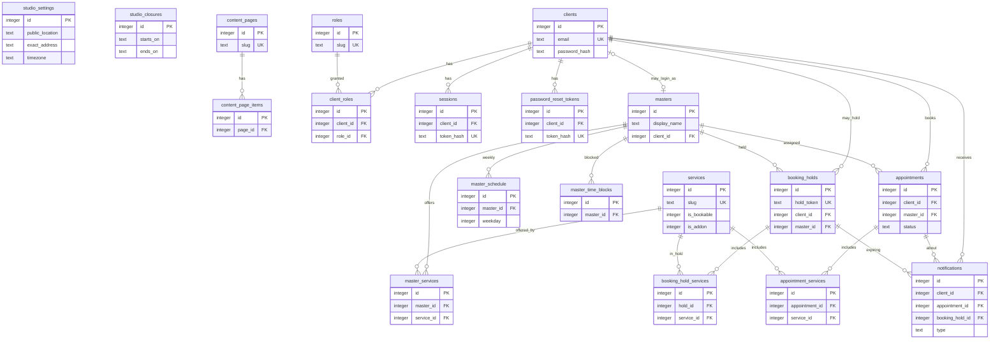

# Схема базы данных SQLite — прототип «Ноготочки»

Документ описывает схему SQLite для прототипа веб-сервиса записи студии «Ноготочки». Код и миграции сюда не входят: только модель данных.

**Реализация** (драйвер, миграции, команды, Node/BeGet, журнал решений): [`docs/database.md`](database.md). Дополняйте тот файл по мере развития бэкенда, эту схему не смешивайте с эксплуатацией.

**Источники:** паспорт сервиса, карта экранов в «Путь клиента» (§3), продуктовые инварианты из `cloud.md`.

**Границы v1:** клиентская запись без оплаты на сайте, без админки, без выезда, без карты и чата. Свободные слоты в таблицу не кладём — их считает приложение в момент запроса.

---

## 1. Назначение и границы

База нужна, чтобы экраны прототипа читали одни и те же услуги, мастеров, записи, сессии и уведомления, а свободное время не расходилось у двух клиентов.

В схему **не входит:**

- платёжные реквизиты, корзина, промокоды;
- таблица заранее нарезанных свободных слотов;
- открытый пароль (только хеш);
- телефон студии и выдуманные ФИО мастеров;
- домашний адрес клиента;
- учётные записи сотрудников (админки в v1 нет).

Черновик выбора услуг до подтверждения дублируется в `localStorage` как `hold_token` для гостя. Источник состава для шага 4, возврата с auth и «сессия истекла» — `booking_holds` + `booking_hold_services`. Без холда в БД два гостя займут одно окно.

---

## 2. Экраны → данные

Карта экранов — «Путь клиента», §3. Ниже — какие данные каждый экран показывает и из каких таблиц они берутся.

### 2.1. Публичные

| Экран | Что показывает | Откуда данные |
|---|---|---|
| Лендинг | Название, кикер «студия маникюра и бровей», hero-фото, полоса доверия (с 2019, несколько мастеров, более 400 клиентов, только по записи), прайс с фото карточек, три мастера, FAQ из четырёх пар вопрос/ответ, футер «центр города» | `studio_settings` (`display_name`, `kicker`, `hero_image_path`, `established_year`, `regular_clients_count`, `public_location`); число мастеров — `COUNT` активных `masters`; `services` + `image_path`; `masters` + `portrait_path`; FAQ — `content_pages` (`slug = 'faq'`) + `content_page_items`. Точного адреса нет. Заголовки hero и «Как записаться» — копирайт экрана, не колонки БД. |
| Каталог услуг | Семь карточек: название, цена, длительность, фото; у сертификата две цены, срок 6 месяцев, CTA «Условия в студии»; баннер, что сертификат не слот | `services` (`is_bookable`, `image_path`, `price_rub_alt`, `validity_months`). Текст баннера — `content_pages` (`slug = 'gift_certificate'`). |
| Каталог мастеров | Список, специализация, портрет 80×80, мета «приём только по записи» | `masters` где `is_active = 1`. Мета каталога — копирайт, не вычисленный слот. |
| Карточка мастера | Имя или «Мастер студии», специализация, крупное фото, ряд ближайших окон, кнопка записи | `masters` (`portrait_path` в каталоге, `cover_path` на карточке) + `master_services`; окна **вычисляются** (§4). Без черновика услуг длительность визита неизвестна: показываем свободные **начала** окон графика, не нарезку под конкретный сеанс. |
| Политика конфиденциальности | Лид + пять пар вопрос/ответ | `content_pages` (`slug = 'privacy'`, `body` = лид) + `content_page_items`. Юрадрес, ИНН, телефон, email студии не храним и не выдумываем. |

На публичных экранах нет `exact_address`, телефона и выдуманных ФИО.

### 2.2. Авторизация

| Экран | Что показывает / принимает | Откуда данные |
|---|---|---|
| Вход | Почта, пароль | Поиск `clients.email`, сверка с `password_hash`. Успех → строка в `sessions`. |
| Регистрация | Почта, пароль, повтор пароля | Новая строка в `clients`. Повтор пароля **не хранится**. Поля пароля в открытом виде нет. |
| Письмо отправлено | Подтверждение, что письмо ушло | Создаётся `password_reset_tokens` (в БД — **хеш** токена, не сам токен письма). |
| Новый пароль | Новый пароль по ссылке | Проверка токена по хешу и `expires_at` / `used_at`; запись нового `password_hash`. |
| Пароль изменён | Баннер успеха | Состояние экрана, без своей таблицы. |
| Вход с ошибкой | Alert в форме | Нет отдельной таблицы ошибок. |

Имя клиента на регистрации не обязательно: `clients.display_name` может быть пустым.

### 2.3. Запись (степпер)

| Шаг / состояние | Что показывает | Откуда данные |
|---|---|---|
| 1. Услуги | Записываемые услуги без сертификата; дизайн как добавка; сумма и длительность | `services` где `is_bookable = 1` и `is_active = 1`. Добавка: `is_addon = 1`. |
| 2. Мастер | Мастера, которые делают **весь** выбранный набор | `masters` + `master_services`. Если пересечение пустое — баннер «нет мастера», четвёртого мастера не выдумывать. |
| 3. Дата и время | Календарь (горизонт из настроек), свободные окна с шагом сетки, таймер после выбора | Окна **считаются** (§4) с `slot_step_minutes`. Выбор создаёт `booking_holds` + `booking_hold_services`. Горизонт: `calendar_horizon_days` (допущение: 56). |
| Нет слотов | Empty на шаге 3; «Другая дата» / «Другой мастер» | Тот же расчёт вернул пустой список. |
| 4. Проверка / гость | Сводка + баннер «нужен вход»; таймер; «Подтвердить» неактивна | Холд по `hold_token` + `booking_hold_services` + `masters` + `services`. **Адреса нет.** |
| 4. Проверка / вход выполнен | Та же сводка, баннер про истекающий резерв, «Подтвердить» активна | После auth холд привязывается к `client_id`; состав берётся из `booking_hold_services`, не только из `localStorage`. |
| 5. Готово | Запись создана, статус «ожидает предоплату», CTA в кабинет | `appointments` (`pending_prepayment`) + `appointment_services`. Имя мастера — JOIN `masters`. Сумма и длительность — снимок в `appointment_services` (`price_rub`, `duration_*`) на момент оформления. Холд удаляется. Адреса нет. |
| Резерв истёк | Empty | Холд с `expires_at` в прошлом (или уже удалён). Записи нет. |
| Слот занят | Empty | Интервал пересекается с чужой записью или чужим живым холдом. |

Гость может выбрать услуги, мастера и время. Подтвердить запись — только после входа (`appointments.client_id` обязателен). Возврат с auth на шаг 4 и текст «выбранные услуги сохранятся» после потери сессии опираются на `booking_hold_services`, не только на браузер.

### 2.4. Кабинет

| Экран | Что показывает | Откуда данные |
|---|---|---|
| Активные | Карточки предстоящих: ожидает предоплату / подтверждена / перенесена; «Подробнее» / «Перенести» / «Отменить», если ещё можно | `appointments` + `appointment_services` + JOIN `masters` / `services`. Статус ∈ {`pending_prepayment`, `confirmed`, `rescheduled`} и `ends_at` в будущем. Кнопки отмены/переноса — по правилу §5.1. |
| Пустой кабинет | Empty | Нет таких записей. |
| История | Отменённые, истёкшие, прошедшие; «Записаться снова» | `cancelled` / `expired`, либо `confirmed`/`rescheduled` с `ends_at` в прошлом. Отмена и перенос всегда недоступны. |
| Детали / ожидает предоплату | Статус, услуги, сумма, длительность, мастер, дата и время, ссылка на правила | `appointments` + `appointment_services` + JOIN `masters` и `services` (название). Сумма = Σ снимка `price_rub`, длительность — по снимку `duration_*`. Адреса нет. |
| Детали / подтверждена | То же + точный адрес строкой | Плюс `studio_settings.exact_address`. Карты нет. |
| Отмена | Модалка на деталях | Если §5.1 запрещает — `Banner / Warning`, статус не менять. Иначе UPDATE → `cancelled`. |
| Перенос | Календарь как шаг 3, без `Timer` гостя; при смене мастера («Другой мастер») обновляется `master_id` | Расчёт окон, исключая **текущую** запись. Успех: новые `starts_at`/`ends_at`, статус `rescheduled`. |
| Перенос / нет слотов | Empty | Расчёт пустой. |
| Профиль | Почта, опционально имя, смена пароля (текущий / новый / повтор) | `clients.email`, `display_name`; смена пишет новый `password_hash` и гасит прочие `sessions`. |
| Уведомления | Пять типов; пустой список — empty в том же лейауте | `notifications` + JOIN записи или холда. Текст пункта собирает приложение по `type`, не хранится в строке. |
| Правила отмены и переноса | FAQ без выдуманных «за 24 часа» и штрафов | `content_pages` (`slug = 'cancellation_rules'`) + `content_page_items`. |

Повтор из истории открывает степпер с теми же `service_id`; мастер — `appointments.master_id`, только если `is_active = 1` и он всё ещё делает набор. Это **новая** запись, не воскрешение старой.

### 2.5. Служебные

| Экран | Данные из БД |
|---|---|
| 404 | Нет |
| Сбой сервера | Нет |
| Сессия истекла | `sessions.expires_at` в прошлом или строки нет. Состав услуг восстанавливается из живого `booking_holds` + `booking_hold_services` по `hold_token` |

### 2.6. Что не хватало после сверки с картой

Первая версия схемы закрывала сущности записи, но не все поля, которые экраны реально рисуют.

| Экран / состояние | Чего не было | Что добавлено |
|---|---|---|
| Лендинг, полоса доверия | «Более 400 клиентов», кикер, hero-фото | `regular_clients_count`, `kicker`, `hero_image_path` |
| Лендинг и каталог услуг | Фото `Service Card` | `services.image_path` |
| Лендинг FAQ, политика, правила | Один `body` на всю страницу — неудобно для пар вопрос/ответ | таблица `content_page_items` |
| Каталог услуг, сертификат | Текст баннера «условия в студии» | `content_pages.slug = 'gift_certificate'` |
| Карточка мастера | Крупное фото отдельно от портрета 80×80 | `masters.cover_path` |
| Шаг 3, карточка, перенос | Не было шага сетки окон (моки 10:00 / 13:00 / 16:30) | `slot_step_minutes` |
| Шаг 4 после входа, «сессия истекла» | Состав услуг только в `localStorage` — сервер не мог вернуть сводку | `booking_hold_services` |
| Кабинет: отмена / перенос / «нельзя» | Нечем было посчитать «ещё можно по правилам», не выдумывая 24 часа | nullable `cancel_min_hours_before`, `reschedule_min_hours_before` + правило §5.1 |
| Уведомление `reminder` | Некогда создавать напоминание | nullable `reminder_hours_before` |
| Уведомление `reserve_expiring` | Не к чему привязать холд без записи | `notifications.booking_hold_id` |
| Свободные интервалы на день | Не было локальной даты, закрытия студии, отсечения «уже прошло сегодня», семантики конца окна | формат `YYYY-MM-DD`; `studio_closures`; `min_lead_minutes`; полуинтервал `[start, end)` в §4 |

Копирайт кнопок, empty-состояния и заголовки hero по-прежнему не в БД.

---

## 3. Формат даты и времени

Во всей базе один контракт. SQLite не имеет отдельного типа DATETIME: даты хранятся как `TEXT`.

| Что храним | Формат | Пример | Где |
|---|---|---|---|
| Момент времени (инстант) | ISO 8601 UTC, секунды, суффикс `Z` | `2026-08-26T07:00:00Z` | `created_at`, `starts_at`, `ends_at`, `expires_at`, `used_at` и остальные таймстемпы |
| Календарный день студии | `YYYY-MM-DD` в поясе студии, не UTC-дата | `2026-08-26` | вход расчёта «свободные интервалы на день»; `studio_closures.starts_on` / `ends_on` |
| Часы в графике | `HH:MM` 24 часа, пояс студии, нулевой паддинг | `10:00`, `16:30` | `master_schedule.start_time`, `end_time` |
| Часовой пояс студии | IANA | `Europe/Moscow` | `studio_settings.timezone` |

Календарный день и UTC-дата могут расходиться: `2026-08-26T21:30:00Z` — это уже 27 августа в `Europe/Moscow`. Свободные интервалы **всегда** считаются для локального `YYYY-MM-DD` студии, затем окна переводятся в UTC.

**Почему так.**

1. Нулевой паддинг и порядок `год-месяц-день-час` дают корректную лексикографическую сортировку TEXT в SQLite (`ORDER BY starts_at` работает без функций).
2. UTC снимает двусмысленность «это уже московское или ещё нет» в записях, холдах и сессиях.
3. График мастера — повторяющиеся **настенные** часы («по вторникам с 10:00»). Их нельзя заменить одним UTC-инстантом. Поэтому часы графика — локальные `HH:MM`, а пояс один на студию.
4. Смешивать `2026-08-26 13:00:00`, unix time и `DD.MM.YYYY` нельзя: сломаются сравнение интервалов и таймер резерва.

При показе на экране инстант переводится в пояс студии. В базу уходит снова UTC.

День недели в графике — ISO: **1 = понедельник … 7 = воскресенье**.

Булевы флаги — `INTEGER` `0` или `1`, не TEXT `'true'`/`'false'`.

Деньги — `INTEGER` в целых рублях. Все цены паспорта целые; `REAL` для денег не используем.

---

## 4. Как считается свободное время

### 4.0. Таблицы свободных слотов нет

Проверка по всем 17 таблицам: сущностей `slots`, `time_slots`, `free_slots`, `available_slots` **нет**. Удалять нечего.

Свободное время **не хранится**. Его считает запрос в момент открытия шага 3, карточки мастера или переноса:

```text
свободные интервалы =
  график мастера (master_schedule на этот weekday)
  − записи (appointments, статусы из таблицы ниже)
  − блокировки (master_time_blocks)
  − живые холды (booking_holds)   ← тоже занятость, не каталог окон
```

Что рядом по имени и **не является** таблицей свободных слотов:

| Объект | Зачем тогда |
|---|---|
| `master_schedule` | Повторяющиеся часы работы. Без строк расчёт всегда пустой |
| `appointments` | Уже занятое время |
| `master_time_blocks` | Разовая недоступность мастера |
| `booking_holds` | Временная занятость до подтверждения записи |
| `studio_closures` | Календарные дни, когда закрыта вся студия. Не окна записи |
| `slot_step_minutes` | Одно число в настройках: шаг нарезки **уже посчитанного** остатка. Не набор строк «10:00 / 13:00 / 16:30» |

### 4.1. Чего не хватало для расчёта (и что добавлено)

Три слагаемых из требования (график, записи, блокировки) в таблицах были. Без вспомогательных полей расчёт на **конкретный день** всё равно ломался. Сводка:

| Данные | Зачем | Статус |
|---|---|---|
| `master_schedule.weekday` + `start_time` + `end_time` | Рабочие окна дня | есть |
| `appointments.master_id`, `starts_at`, `ends_at`, `status` | Вычесть визиты | есть |
| `master_time_blocks.starts_at`, `ends_at` | Вычесть отпуск / выходной мастера | есть |
| `studio_settings.timezone` | Склеить `HH:MM` графика с UTC записей | есть |
| Календарный день `YYYY-MM-DD` | Вход «этот день», не UTC-дата | есть, формат в §3 |
| `masters.is_active` | Неактивный мастер без окон | есть |
| Статусы, которые занимают время | Отмена не должна держать окно | есть, §4.4 |
| Полуинтервал `[start, end)` | Стык 11:30–11:30 не двойная бронь | есть |
| `min_lead_minutes` | На сегодня отсечь уже прошедшее | есть |
| `studio_closures` | Праздник ≠ «открытый вторник» | есть |
| Живые `booking_holds` | Иначе два гостя на одно время | есть; это занятость |
| `CHECK (ends_at > starts_at)` у занятости | Нулевая или вывернутая бронь ломает вычитание | **добавлен** ниже |
| Часы работы в паспорте | Без сидов график пустой, окон нет | **добавлено допущение сида** в `master_schedule` |
| Таблица свободных слотов | — | **не нужна и не создаётся** |

Разовое «открыть воскресенье вне шаблона» по-прежнему не моделируется: блокировки только вычитают.

Все интервалы в расчёте — полуинтервалы **`[start, end)`**: конец не входит. Две записи 10:00–11:30 и 11:30–13:00 не пересекаются. Визит должен **закончиться не позже** конца рабочего окна: при графике 10:00–18:00 и сеансе 90 мин последний старт — 16:30, не 18:00.

Ночные смены через полночь в v1 не поддерживаются: у строки графика `end_time > start_time` в тот же календарный день.

### 4.2. Входы запроса «мастер × день»

| Вход | Откуда | Без этого |
|---|---|---|
| `master_id` | параметр экрана | непонятно, чей день |
| `local_date` | `YYYY-MM-DD` в поясе студии (шаг 3, карточка, перенос) | нельзя выбрать строки графика и границы дня |
| `timezone` | `studio_settings.timezone` | `10:00` и записи в UTC не сопоставить |
| «сегодня» студии и `now` | часы сервера + тот же пояс | на сегодня всплывут уже прошедшие часы |
| `min_lead_minutes` | `studio_settings` | нельзя отсечь «слишком близко к сейчас»; `0` = любой старт строго после `now` |
| `calendar_horizon_days` | `studio_settings` | день за горизонтом 8 недель не должен давать окна |
| `masters.is_active` | `masters` | неактивный мастер не должен иметь окон |
| рабочие окна | `master_schedule` на ISO-weekday(`local_date`) | не из чего вычитать занятость |
| закрытие студии | `studio_closures` | праздник по вторничному графику останется «открытым» |
| записи | `appointments` занимающих статусов | двойная бронь |
| живые холды | `booking_holds` с `expires_at > now` | два гостя займут одно окно |
| блокировки мастера | `master_time_blocks` | отпуск не вычтется |
| `exclude_appointment_id` | параметр переноса, необязательный | клиент не увидит свой текущий слот |
| `exclude_hold_token` | параметр шага 3, необязательный | выбранный слот исчезнет из списка как «занятый собой» |

Длительность визита для **сырых свободных интервалов не нужна**. Она нужна только на следующем шаге: отбросить дырки короче сеанса и нарезать старты с `slot_step_minutes`.

### 4.3. Алгоритм на конкретный день

```text
1. Если master.is_active = 0 → пусто.
2. today = календарный день now в timezone.
   Если local_date < today → пусто.
   Если local_date > today + calendar_horizon_days → пусто.
3. Если существует studio_closures, где
     starts_on <= local_date AND ends_on >= local_date
   → пусто (студия закрыта).
4. day_start = local_date 00:00:00 в timezone, как UTC.
   day_end   = (local_date + 1 день) 00:00:00 в timezone, как UTC.
   earliest  = max(day_start, now + min_lead_minutes).
5. windows = master_schedule этого мастера, weekday = ISO-день local_date.
   Каждую строку превратить в UTC: [local_date+start_time, local_date+end_time).
   Обрезать каждое окно снизу по earliest (на сегодня утро уже прошло).
   Окна нулевой длины выбросить.
6. busy = объединение пересекающихся с [day_start, day_end):
     appointments  где status занимает время
                  и master_id совпал
                  и не id = exclude_appointment_id
     booking_holds где expires_at > now
                  и master_id совпал
                  и не hold_token = exclude_hold_token
     master_time_blocks этого мастера
   Пересечение: a.starts_at < b.ends_at AND a.ends_at > b.starts_at.
7. free = windows − busy  (разность полуинтервалов).
```

На шаг 3, карточку мастера и перенос — один алгоритм. Дальше, если известна длительность визита D (верхняя граница добавки, §10.6):

```text
8. Оставить только отрезки длиной ≥ D.
9. Старты слотов: от начала каждого отрезка с шагом slot_step_minutes,
   пока start + D <= конец отрезка.
```

На карточке мастера без черновика шаг 8–9 пропускают: в UI показывают свободные начала оставшихся окон, не нарезку под сеанс.

Моковые часы 10:00 / 13:00 / 16:30 на макете — иллюстрация, не таблица слотов.

### 4.4. Какие записи занимают время

| Статус | Занимает интервал |
|---|---|
| `pending_prepayment` | да |
| `confirmed` | да |
| `rescheduled` | да (актуальные `starts_at`/`ends_at`) |
| `cancelled` | нет |
| `expired` | нет |

При переносе и на шаге 3 свой интервал исключается параметрами из §4.2, а не отдельным статусом.

SQLite не умеет запретить пересечение диапазонов ограничением UNIQUE. Проверка «окно ещё свободно» выполняется **в одной транзакции** с `BEGIN IMMEDIATE` в момент создания холда, подтверждения записи и переноса. Без этого два клиента получат одно время.

Истёкшие холды в расчёт не входят (`expires_at <= now`). Их можно периодически удалять; на корректность расчёта это не влияет, если фильтр по сроку на месте.

Дополнительный рабочий день вне недельного графика (разовое воскресенье) в v1 **не моделируется**: блокировки и закрытия студии только вычитают время. Чтобы открыть лишний день, нужна строка в `master_schedule` на этот weekday или сид графика. См. §10.17.

---

## 5. Статусы записи

Фиксированный набор. В колонке `appointments.status` — код, не произвольная строка. Подпись для UI задаётся в приложении, не в свободном тексте строки.

| Код в БД | Подпись в UI | Кто выставляет | Где виден |
|---|---|---|---|
| `pending_prepayment` | Ожидает предоплату | Клиент, нажал «Подтвердить запись» | Шаг «Готово», активные, детали без адреса |
| `confirmed` | Подтверждена | Не клиент: в v1 нет оплаты на сайте, смена — вручную / будущая админка | Активные, детали **с адресом** |
| `cancelled` | Отменена | Клиент подтвердил модалку отмены | История |
| `rescheduled` | Перенесена | Клиент подтвердил перенос | Активные (если визит ещё впереди) |
| `expired` | Истекла | Приложение, когда `pending_prepayment` и время визита уже прошло (лениво при чтении или фоновой задачей) | История |

Ограничение:

```sql
CHECK (status IN (
  'pending_prepayment',
  'confirmed',
  'cancelled',
  'rescheduled',
  'expired'
))
```

Прошедший визит (`confirmed` или `rescheduled` и `ends_at` в прошлом) **не** получает шестой статус: он просто попадает во вкладку «История».

Временный резерв слота **до** подтверждения — не статус записи, а строка `booking_holds`. В паспорте нет статуса «зарезервирована».

### 5.1. Когда можно отменить и перенести

Экраны: карточка в «Активных», детали, модалка отмены, перенос, баннер «нельзя» в истории.

Паспорт и правила кабинета **запрещают выдумывать** «за 24 часа» и штрафы. Пока в базе знаний нет срока, колонки ниже — `NULL`, и действует только это:

| Условие | Отмена | Перенос |
|---|---|---|
| Статус `cancelled` или `expired` | нет | нет |
| Вкладка «История» / `ends_at` уже в прошлом | нет | нет |
| Статус `pending_prepayment`, `confirmed` или `rescheduled`, визит ещё не начался (`starts_at` > сейчас) | да | да |
| `cancel_min_hours_before` (или `reschedule_min_hours_before`) задан и до `starts_at` осталось меньше | нет | нет |

Без заполненного срока кнопки на активной будущей записи остаются. Прямая ссылка на отмену истории — `Banner / Warning`, статус не менять.

---

## 6. Таблицы

Имена таблиц и колонок — `snake_case`, английские. Комментарии и этот документ — на русском. Всего **19 таблиц** (17 исходных плюс `roles` и `client_roles`). Колонки `clients.role` нет: роли — список в `client_roles`.

Первичные ключи: у каждой таблицы свой `INTEGER PRIMARY KEY` (`id`). Связки мастер–услуга и холд–услуга дополнительно имеют UNIQUE на пару ключей. Внешние ключи ссылаются только на PK (`id`) целевой таблицы; нужен `PRAGMA foreign_keys = ON`. Одно значение не копируется во вторую таблицу: см. §6.18. Пароль в открытом виде не хранится: см. §6.19.

Булево: `INTEGER NOT NULL` со значениями `0` или `1`.

### 6.1. `studio_settings`

**Назначение.** Одна строка настроек студии: витрина лендинга, адрес, пояс, горизонт календаря, длительность резерва, шаг сетки окон.

| Поле | Тип | Обязательное | Ключ | Описание |
|---|---|---|---|---|
| `id` | INTEGER | да | PK, CHECK (`id = 1`) | Всегда единственная строка |
| `display_name` | TEXT | да | | «Ноготочки» |
| `kicker` | TEXT | нет | | Кикер hero: «Студия маникюра и бровей» |
| `hero_image_path` | TEXT | нет | | Крупное фото hero на лендинге |
| `public_location` | TEXT | да | | «центр города» — лендинг, футер, публичные экраны |
| `exact_address` | TEXT | нет | | Строка адреса. Показывать только в деталях при статусе `confirmed`. Может быть пустым, пока нет данных из базы знаний — тогда UI не выдумывает улицу |
| `timezone` | TEXT | да | | IANA, для прототипа `Europe/Moscow` |
| `calendar_horizon_days` | INTEGER | да | | Допущение: `56` (8 недель) |
| `slot_step_minutes` | INTEGER | да | | Шаг нарезки стартов из свободного интервала, для прототипа `30`. Не таблица готовых слотов |
| `min_lead_minutes` | INTEGER | да | | Минимум минут от `now` до старта. `0` — любой старт строго после `now`. Без поля на сегодня всплывут уже прошедшие часы |
| `reserve_minutes` | INTEGER | да | | Сколько минут живёт `booking_holds`. Минуты **не** пишем в продуктовом копирайте, но для таймера число нужно |
| `established_year` | INTEGER | нет | | 2019 — полоса доверия на лендинге |
| `regular_clients_count` | INTEGER | нет | | 400; в UI «более 400 клиентов». Не путать с `COUNT(clients)` |
| `cancel_min_hours_before` | INTEGER | нет | | NULL = в базе знаний нет срока, см. §5.1. Не заполнять «24», пока этого нет во входных документах |
| `reschedule_min_hours_before` | INTEGER | нет | | То же для переноса |
| `reminder_hours_before` | INTEGER | нет | | За сколько часов создавать `notifications.type = 'reminder'`. NULL = в прототипе только сиды, срок не выдумывать |
| `created_at` | TEXT | да | | ISO 8601 UTC |
| `updated_at` | TEXT | да | | ISO 8601 UTC |

Точный адрес **не** дублируется в `appointments`: он свойство студии, не визита. Показ зависит от статуса записи.

### 6.2. `studio_closures`

**Назначение.** Дни, когда студия закрыта целиком (праздник, санитарный день). В расчёте свободных интервалов (§4.3 шаг 3) такой `local_date` даёт пустой список **до** чтения графика мастера. Иначе вторник-праздник останется открытым по недельному шаблону.

Это не таблица свободных слотов и не блокировка одного мастера.

| Поле | Тип | Обязательное | Ключ | Описание |
|---|---|---|---|---|
| `id` | INTEGER | да | PK | |
| `starts_on` | TEXT | да | | Первый закрытый день, `YYYY-MM-DD` в поясе студии, включительно |
| `ends_on` | TEXT | да | | Последний закрытый день, `YYYY-MM-DD`, включительно. CHECK (`ends_on >= starts_on`). Один день: оба поля одинаковые |
| `reason` | TEXT | нет | | Для сидов. Клиенту не показывать, если в базе знаний нет формулировки |
| `created_at` | TEXT | да | | ISO 8601 UTC |

Отпуск одного мастера сюда не класть — это `master_time_blocks` на интервал UTC.

### 6.3. `content_pages`

**Назначение.** Страницы из базы знаний: политика, правила отмены и переноса, FAQ лендинга, баннер сертификата. Лид страницы — в `body`; пары вопрос/ответ — в `content_page_items`.

| Поле | Тип | Обязательное | Ключ | Описание |
|---|---|---|---|---|
| `id` | INTEGER | да | PK | |
| `slug` | TEXT | да | UNIQUE | `privacy`, `cancellation_rules`, `faq`, `gift_certificate` |
| `title` | TEXT | да | | Заголовок страницы |
| `body` | TEXT | нет | | Лид или баннер. Для FAQ лендинга может быть пустым: пары живут в `content_page_items`. Дедлайны и штрафы не выдумывать |
| `created_at` | TEXT | да | | ISO 8601 UTC |
| `updated_at` | TEXT | да | | ISO 8601 UTC |

### 6.4. `content_page_items`

**Назначение.** Пары вопрос/ответ для лендинга, политики и правил кабинета (макет: FAQ + `Divider`, не один сплошной текст).

| Поле | Тип | Обязательное | Ключ | Описание |
|---|---|---|---|---|
| `id` | INTEGER | да | PK | |
| `page_id` | INTEGER | да | FK → `content_pages.id` ON DELETE CASCADE | |
| `question` | TEXT | да | | Вопрос |
| `answer` | TEXT | да | | Ответ из базы знаний |
| `sort_order` | INTEGER | да | | Порядок на экране. UNIQUE вместе с `page_id` |
| `created_at` | TEXT | да | | ISO 8601 UTC |

Ориентир сидов (не выдумывать новые темы):

| slug страницы | Сколько пар | Экран |
|---|---|---|
| `faq` | 4 | Лендинг: отмена в кабинете; предоплата вне сайта; без записи нельзя; адрес после подтверждения |
| `privacy` | 5 | Политика: данные входа; данные записи; сайт не принимает оплату; адрес; уведомления без SMS |
| `cancellation_rules` | из базы знаний | Правила кабинета |
| `gift_certificate` | 0 | Баннер каталога услуг — только `content_pages.body` |

### 6.5. `clients`

**Назначение.** Учётная запись клиента: вход, регистрация, профиль.

| Поле | Тип | Обязательное | Ключ | Описание |
|---|---|---|---|---|
| `id` | INTEGER | да | PK | |
| `email` | TEXT | да | UNIQUE | Логин. Сравнивать нормализованно (нижний регистр) на уровне приложения |
| `password_hash` | TEXT | да | | Только salted scrypt (PHC: `$scrypt$N=…$r=…$p=…$salt$hash`). Колонок `password`, `password_plain`, `passwd` **нет** и заводить нельзя. Не bcrypt и не argon2: native-аддоны на BeGet не собираются |
| `display_name` | TEXT | нет | | Имя в профиле. Регистрация его не требует |
| `created_at` | TEXT | да | | ISO 8601 UTC |
| `updated_at` | TEXT | да | | ISO 8601 UTC |

Повтор пароля на форме регистрации и поля «текущий / новый / повтор» при смене живут только в запросе UI. В таблицу попадает новый `password_hash`. Открытый пароль не пишется ни в `clients`, ни в логи, ни в `password_reset_tokens` (там хеш **токена** ссылки, не пароля).

Роль в этой таблице не хранится. Список ролей — `client_roles` (§6.21).

### 6.21. `roles`

**Назначение.** Справочник ролей API. Человек может иметь несколько ролей сразу.

| Поле | Тип | Обязательное | Ключ | Описание |
|---|---|---|---|---|
| `id` | INTEGER | да | PK | |
| `slug` | TEXT | да | UNIQUE | `client`, `master`, `administrator` |
| `created_at` | TEXT | да | | ISO 8601 UTC |

### 6.22. `client_roles`

**Назначение.** Список ролей клиента (junction). Авторизация смотрит, есть ли нужный slug **в списке**, а не равен ли один столбец одному значению. Источник прав — эта таблица, не `ADMIN_EMAILS` и не поле `role` в теле запроса.

| Поле | Тип | Обязательное | Ключ | Описание |
|---|---|---|---|---|
| `id` | INTEGER | да | PK | |
| `client_id` | INTEGER | да | FK → `clients.id` ON DELETE CASCADE | UNIQUE вместе с `role_id` |
| `role_id` | INTEGER | да | FK → `roles.id` ON DELETE RESTRICT | |
| `created_at` | TEXT | да | | ISO 8601 UTC |

Сиды разработки: `admin@nogotochki.test` → `administrator`; `master@nogotochki.test` → `master` и `masters.client_id` на мастера `id=1`; `client@nogotochki.test` → `client`. Регистрация выдаёт роль `client`.

Видимость записей — объединение ролей: клиент видит свои (`appointments.client_id`); мастер — записи своего графика (`master_id`); администратор — все. Отмена и перенос в v1 остаются у владельца записи; подтверждение (`confirmed`) — у администратора.

### 6.6. `sessions`

**Назначение.** Выданные сессии. Нужны экрану «сессия истекла» и выходу.

| Поле | Тип | Обязательное | Ключ | Описание |
|---|---|---|---|---|
| `id` | INTEGER | да | PK | |
| `client_id` | INTEGER | да | FK → `clients.id` ON DELETE CASCADE | Владелец |
| `token_hash` | TEXT | да | UNIQUE | Хеш токена из cookie. Сам токен в БД не хранить |
| `expires_at` | TEXT | да | | ISO 8601 UTC. `expires_at <= сейчас` → сессия недействительна |
| `created_at` | TEXT | да | | ISO 8601 UTC |

### 6.7. `password_reset_tokens`

**Назначение.** Одноразовые ссылки «забыли пароль».

| Поле | Тип | Обязательное | Ключ | Описание |
|---|---|---|---|---|
| `id` | INTEGER | да | PK | |
| `client_id` | INTEGER | да | FK → `clients.id` ON DELETE CASCADE | |
| `token_hash` | TEXT | да | UNIQUE | Хеш токена из письма, не сам токен |
| `expires_at` | TEXT | да | | ISO 8601 UTC |
| `used_at` | TEXT | нет | | Когда использовали. Повтор по той же ссылке запрещён |
| `created_at` | TEXT | да | | ISO 8601 UTC |

### 6.8. `services`

**Назначение.** Прайс студии. Источник карточек лендинга, каталога и шага 1.

| Поле | Тип | Обязательное | Ключ | Описание |
|---|---|---|---|---|
| `id` | INTEGER | да | PK | |
| `slug` | TEXT | да | UNIQUE | Стабильный ключ: `manicure_gel`, `manicure_pedicure`, `extension`, `nail_design`, `brow_correction`, `brow_lamination`, `gift_certificate` |
| `name` | TEXT | да | | Название из паспорта |
| `description` | TEXT | нет | | Короткое описание для карточки, без выдуманных скидок |
| `price_rub` | INTEGER | да | | Цена в рублях. У сертификата — 3000 |
| `price_rub_alt` | INTEGER | нет | | Вторая цена. Только сертификат: 5000 |
| `duration_min_minutes` | INTEGER | нет | | Нижняя длительность. У сертификата NULL |
| `duration_max_minutes` | INTEGER | нет | | Верхняя. У обычной услуги равна min (90, 150, 40, 60…). У дизайна ногтей 15 и 30 |
| `is_addon` | INTEGER | да | | `1` — добавка к сеансу (дизайн ногтей), не отдельный визит |
| `is_bookable` | INTEGER | да | | `0` — не класть в степпер (сертификат) |
| `validity_months` | INTEGER | нет | | Срок сертификата: 6. У остальных NULL |
| `image_path` | TEXT | нет | | Фото `Service Card` на лендинге и в каталоге |
| `is_active` | INTEGER | да | | `0` — не показывать клиенту в каталоге и записи; админ видит все строки. Не путать с `is_bookable` (сертификат не слот) |
| `sort_order` | INTEGER | да | | Порядок в каталоге |
| `created_at` | TEXT | да | | ISO 8601 UTC |
| `updated_at` | TEXT | да | | ISO 8601 UTC |

Правила шага 1 живут в приложении, не в отдельной таблице: хотя бы одна услуга с `is_bookable = 1`, `is_active = 1` и `is_addon = 0`; добавку нельзя подтвердить одну. Отключённые (`is_active = 0`) клиенту в записи не показываем; админ видит все.

Сиды прайса (для ориентира, не миграция):

| slug | price_rub | duration min–max | is_addon | is_bookable |
|---|---|---|---|---|
| `manicure_gel` | 1800 | 90–90 | 0 | 1 |
| `manicure_pedicure` | 3200 | 150–150 | 0 | 1 |
| `extension` | 2800 | 150–150 | 0 | 1 |
| `nail_design` | 300 | 15–30 | 1 | 1 |
| `brow_correction` | 1200 | 40–40 | 0 | 1 |
| `brow_lamination` | 1800 | 60–60 | 0 | 1 |
| `gift_certificate` | 3000 (`price_rub_alt` 5000) | NULL | 0 | 0 |

### 6.9. `masters`

**Назначение.** Мастера студии. Каталог, карточка, шаг 2.

| Поле | Тип | Обязательное | Ключ | Описание |
|---|---|---|---|---|
| `id` | INTEGER | да | PK | |
| `display_name` | TEXT | нет | | Если NULL или пусто — в UI всегда «Мастер студии». ФИО не выдумывать |
| `specialization_label` | TEXT | да | | Подпись карточки: «Маникюр и покрытие» / «Педикюр и комплексы» / «Брови» |
| `portrait_path` | TEXT | нет | | Квадратный портрет 80×80: лендинг, каталог, шаг 2 |
| `cover_path` | TEXT | нет | | Крупное фото `Media Frame` на карточке мастера. Если NULL — можно показать `portrait_path`, не выдумывая другое лицо |
| `is_active` | INTEGER | да | | `0` — не показывать в записи, каталоге и не подставлять при «записаться снова» |
| `sort_order` | INTEGER | да | | Порядок в каталоге |
| `client_id` | INTEGER | нет | UNIQUE (nullable), FK → `clients.id` ON DELETE SET NULL | Учётная запись с ролью `master`, чей это график. NULL, если мастер не привязан к входу |
| `created_at` | TEXT | да | | ISO 8601 UTC |
| `updated_at` | TEXT | да | | ISO 8601 UTC |

Телефон мастера в схему не входит.

### 6.10. `master_services`

**Назначение.** Какие услуги мастер может выполнить. Фильтр шага 2 и проверка «нет мастера под набор».

| Поле | Тип | Обязательное | Ключ | Описание |
|---|---|---|---|---|
| `id` | INTEGER | да | PK | |
| `master_id` | INTEGER | да | FK → `masters.id` ON DELETE CASCADE | UNIQUE вместе с `service_id` |
| `service_id` | INTEGER | да | FK → `services.id` ON DELETE CASCADE | Только `is_bookable = 1` |

Мастер подходит под набор, если для **каждой** выбранной услуги есть строка в этой таблице. Добавка «дизайн ногтей» тоже должна быть привязана к тем мастерам, которые делают маникюрные услуги.

`specialization_label` — текст для карточки. Источник истины «кто что делает» — эта таблица, не подпись.

### 6.11. `master_schedule`

**Назначение.** Повторяющийся график работы. Одно из трёх слагаемых расчёта свободного времени.

| Поле | Тип | Обязательное | Ключ | Описание |
|---|---|---|---|---|
| `id` | INTEGER | да | PK | |
| `master_id` | INTEGER | да | FK → `masters.id` ON DELETE CASCADE | |
| `weekday` | INTEGER | да | | ISO: 1 пн … 7 вс. CHECK (`weekday BETWEEN 1 AND 7`) |
| `start_time` | TEXT | да | | `HH:MM` в поясе студии |
| `end_time` | TEXT | да | | `HH:MM`, CHECK (`end_time > start_time`). Конец рабочего окна **не входит** в приём: визит должен закончиться ≤ этого часа |
| `created_at` | TEXT | да | | ISO 8601 UTC |

UNIQUE (`master_id`, `weekday`, `start_time`) — одно окно не дублируется.

Два окна в один день (утро и вечер / обед) — две строки. Разовый выходной мастера — `master_time_blocks` на `[day_start, day_end)` в UTC, не пустая строка графика (пустой weekday = выходной **каждую** такую неделю).

Админки в v1 нет: график заполняется сидами.

Часы работы **в паспорте не заданы**. Без строк `master_schedule` алгоритм §4.3 всегда возвращает пусто. Допущение прототипа (не факт паспорта), пока студия не даст иные часы:

| weekday | start_time | end_time | Комментарий |
|---|---|---|---|
| 1–6 (пн–сб) | `10:00` | `18:00` | Одно окно; обед — вторая строка, если появится |
| 7 (вс) | — | — | Нет строк = выходной |

Ориентир макета шага 3: 10:00 / 13:00 / 16:30 как возможные старты внутри 10:00–18:00; 18:00 unavailable, потому что конец окна не входит в приём. Это не сиды слотов.

### 6.12. `master_time_blocks`

**Назначение.** Разовая недоступность мастера: отпуск, больничный, закрытый день. Второе слагаемое вычитания при расчёте окон.

| Поле | Тип | Обязательное | Ключ | Описание |
|---|---|---|---|---|
| `id` | INTEGER | да | PK | |
| `master_id` | INTEGER | да | FK → `masters.id` ON DELETE CASCADE | |
| `starts_at` | TEXT | да | | ISO 8601 UTC. CHECK (`ends_at > starts_at`) |
| `ends_at` | TEXT | да | | ISO 8601 UTC, конец **не входит** (`[starts_at, ends_at)`). Выходной день: `day_start` … `day_end` следующих суток |
| `reason` | TEXT | нет | | Для сидов и будущей админки. Клиенту не показывать |
| `created_at` | TEXT | да | | ISO 8601 UTC |

Это **занятые** интервалы, не каталог свободных слотов.

### 6.13. `booking_holds`

**Назначение.** Временный резерв конкретного интервала с шага 3 до подтверждения или истечения таймера. Не путать с таблицей свободных слотов: здесь хранятся только занятые на время резерва куски.

| Поле | Тип | Обязательное | Ключ | Описание |
|---|---|---|---|---|
| `id` | INTEGER | да | PK | |
| `hold_token` | TEXT | да | UNIQUE | Токен на клиенте (гость ещё без аккаунта). По нему находят холд после входа |
| `client_id` | INTEGER | нет | FK → `clients.id` ON DELETE SET NULL | NULL у гостя; после входа можно проставить |
| `master_id` | INTEGER | да | FK → `masters.id` ON DELETE CASCADE | |
| `starts_at` | TEXT | да | | Начало интервала, ISO 8601 UTC. CHECK (`ends_at > starts_at`) |
| `ends_at` | TEXT | да | | Конец, полуинтервал `[starts_at, ends_at)`; длина = верхняя граница длительности визита |
| `expires_at` | TEXT | да | | `created_at` + `reserve_minutes`. Таймер на шагах 3–4 |
| `created_at` | TEXT | да | | ISO 8601 UTC |
| `updated_at` | TEXT | да | | ISO 8601 UTC; после входа, когда проставляется `client_id` |

Поведение:

- выбор нового слота удаляет предыдущий холд этого `hold_token` вместе с `booking_hold_services`;
- смена услуг или мастера, из-за которой интервал больше не подходит, удаляет холд;
- успешное «Подтвердить запись» пишет те же `service_id` в `appointment_services`, удаляет холд;
- истечение (`expires_at <= сейчас`) — экран «резерв истёк», записи нет;
- потеря сессии: живой холд по `hold_token` возвращает состав на шаг 4.

### 6.14. `booking_hold_services`

**Назначение.** Состав черновика на время резерва. Нужен шагу 4 после входа, экрану «сессия истекла» и проверке длительности на сервере. Не каталог свободных слотов.

| Поле | Тип | Обязательное | Ключ | Описание |
|---|---|---|---|---|
| `id` | INTEGER | да | PK | |
| `hold_id` | INTEGER | да | FK → `booking_holds.id` ON DELETE CASCADE | UNIQUE вместе с `service_id` |
| `service_id` | INTEGER | да | FK → `services.id` ON DELETE RESTRICT | Только `is_bookable = 1` |
| `sort_order` | INTEGER | да | | Порядок в сводке |

Цены и длительности при показе сводки холда читаются из `services` по `service_id`. Снимка в составе холда нет: черновик ещё не запись. После подтверждения цена и длительность копируются в `appointment_services` (§6.16).

### 6.15. `appointments`

**Назначение.** Подтверждённая клиентом запись (сразу со статусом «ожидает предоплату») и её дальнейшая жизнь в кабинете.

| Поле | Тип | Обязательное | Ключ | Описание |
|---|---|---|---|---|
| `id` | INTEGER | да | PK | |
| `client_id` | INTEGER | да | FK → `clients.id` ON DELETE RESTRICT | Гость подтвердить не может |
| `master_id` | INTEGER | да | FK → `masters.id` ON DELETE RESTRICT | Мастер визита. Имя — `masters.display_name`, не колонка записи |
| `starts_at` | TEXT | да | | ISO 8601 UTC. CHECK (`ends_at > starts_at`) |
| `ends_at` | TEXT | да | | ISO 8601 UTC, полуинтервал `[starts_at, ends_at)`. Занятый интервал этого визита, не копия длительности из прайса |
| `status` | TEXT | да | CHECK, см. §5 | Код из фиксированного набора |
| `created_at` | TEXT | да | | ISO 8601 UTC |
| `updated_at` | TEXT | да | | ISO 8601 UTC |
| `confirmed_at` | TEXT | нет | | Когда статус стал `confirmed` |
| `cancelled_at` | TEXT | нет | | Когда статус стал `cancelled` |
| `rescheduled_at` | TEXT | нет | | Когда последний раз перенесли |
| `expired_at` | TEXT | нет | | Когда статус стал `expired` |

Сумма и длительность на экранах: Σ снимка `appointment_services.price_rub` и `duration_*`. Не дублировать итог в строке `appointments`.

Перенос **не** создаёт вторую строку: меняются `starts_at`/`ends_at`, статус → `rescheduled`, пишется `rescheduled_at`. Старый интервал свободен сам собой.

Повтор из истории создаёт **новую** строку.

`ON DELETE RESTRICT` у клиента и мастера: историю визитов нельзя потерять каскадом.

### 6.16. `appointment_services`

**Назначение.** Состав визита: какие услуги входят в запись. Название и флаг добавки читаются из `services` по `service_id`. Цена и длительность — снимок на момент оформления, чтобы смена прайса не переписывала старые визиты.

| Поле | Тип | Обязательное | Ключ | Описание |
|---|---|---|---|---|
| `id` | INTEGER | да | PK | |
| `appointment_id` | INTEGER | да | FK → `appointments.id` ON DELETE CASCADE | |
| `service_id` | INTEGER | да | FK → `services.id` ON DELETE RESTRICT | Ссылка на позицию прайса (название, флаги) |
| `price_rub` | INTEGER | да | | Цена услуги в рублях **на момент оформления** |
| `duration_min_minutes` | INTEGER | нет | | Нижняя длительность на момент оформления |
| `duration_max_minutes` | INTEGER | нет | | Верхняя длительность на момент оформления; ею режется слот |
| `sort_order` | INTEGER | да | | Порядок выбора в сводке, не копия `services.sort_order` |

«Записаться снова» берёт те же `service_id`. Услугу с прайса нельзя удалить, пока на неё есть записи (`RESTRICT`): админка тогда **отключает** (`is_active = 0`), а не стирает строку. Смена цены в каталоге **не** меняет отображение старых визитов — см. §6.18.

### 6.17. `notifications`

**Назначение.** Лента уведомлений кабинета. Событие и ссылка на запись или холд. Заголовок и текст **не** хранятся: UI собирает их по `type` из записи/холда.

| Поле | Тип | Обязательное | Ключ | Описание |
|---|---|---|---|---|
| `id` | INTEGER | да | PK | |
| `client_id` | INTEGER | да | FK → `clients.id` ON DELETE CASCADE | Владелец ленты. Не копия полей визита: без этой колонки список «мои уведомления» требует UNION по записи и холду |
| `appointment_id` | INTEGER | нет | FK → `appointments.id` ON DELETE CASCADE | Визит для confirmed / reminder / cancelled / rescheduled. CASCADE: иначе SET NULL ломает CHECK «есть запись или холд» |
| `booking_hold_id` | INTEGER | нет | FK → `booking_holds.id` ON DELETE CASCADE | Только `reserve_expiring`. CASCADE: удаление холда (подтверждение или истечение) убирает уведомление, не оставляет пустую ссылку |
| `type` | TEXT | да | CHECK | См. ниже |
| `is_read` | INTEGER | да | | `0` / `1` |
| `created_at` | TEXT | да | | ISO 8601 UTC, сортировка ленты |

CHECK: задан `appointment_id` или `booking_hold_id`.

```sql
CHECK (type IN (
  'confirmed',
  'reminder',
  'cancelled',
  'rescheduled',
  'reserve_expiring'
))
```

| type | Когда появляется |
|---|---|
| `confirmed` | Статус записи стал `confirmed` (в деталях появляется адрес) |
| `reminder` | Напоминание о визите |
| `cancelled` | Запись отменена |
| `rescheduled` | Запись перенесена |
| `reserve_expiring` | Живой холд, клиент уже вошёл; `booking_hold_id` задан |

Пустой список уведомлений — состояние UI, без отдельной таблицы.

### 6.18. Дубли полей: где факт, где только ключ

Одно и то же значение не копируется во вторую таблицу. Связанная строка хранит внешний ключ и при показе делает JOIN.

| Что дублировалось | Где должен жить факт | Что остаётся в другой таблице |
|---|---|---|
| Имя мастера | `masters.display_name` | `appointments.master_id` |
| Название и флаг добавки услуги | `services` (`name`, `is_addon`) | `appointment_services.service_id` и `booking_hold_services.service_id` |
| Цена и длительность уже оформленного визита | снимок в `appointment_services` (`price_rub`, `duration_min_minutes`, `duration_max_minutes`) на момент `insertAppointment` | актуальный прайс остаётся в `services`; холд по-прежнему читает живой прайс |
| Сумма и длительность визита | Считаются: Σ по услугам записи | В `appointments` нет `total_price_rub` и `duration_*` |
| Текст уведомления (услуги, дата, мастер) | Запись / холд + словарь подписей по `type` в приложении | `notifications.appointment_id` или `booking_hold_id`, плюс `type` |
| Точный адрес студии | `studio_settings.exact_address` | В записи адреса нет; показ, если `status = 'confirmed'` |
| Длительность резерва | `studio_settings.reserve_minutes` | У холда только свой `expires_at` (момент конца **этого** резерва; настройка могла смениться) |

`sort_order` в составе визита — порядок, в котором клиент отметил услуги, не копия `services.sort_order`.

`starts_at` / `ends_at` у записи, холда и блокировки — **разные** интервалы (визит, временный резерв, отпуск), не три копии одного факта. Их нельзя заменить ключом на график: занятость уже произошла.

`display_name` у студии, мастера и клиента — разные сущности.

`created_at` на каждой строке — метаданные этой строки, не дубль.

`notifications.client_id` — владелец ленты. Совпадает с клиентом записи, но без колонки «мои уведомления» не выбираются одним равенством (часть строк ссылается только на холд).

Если имя мастера или название услуги изменятся, карточки старых визитов покажут новые подписи. Цена и длительность уже оформленного визита не поедут: они в снимке `appointment_services`. Занятое время — в `appointments.starts_at` / `ends_at`.

### 6.19. Пароль, первичные и внешние ключи

**Пароль.** В `clients` есть только `password_hash` (salted scrypt с параметрами в строке). Поля для открытого пароля нет. Формы входа, регистрации и смены передают пароль в приложение; в SQLite пишется результат `crypto.scrypt`. В `sessions` и `password_reset_tokens` — хеш **токена**, не пароля.

**Первичный ключ** есть у всех 17 таблиц: колонка `id` INTEGER PRIMARY KEY.

**Внешние ключи** ссылаются на `id` родителя. Сводка:

| Таблица | FK | Родитель | ON DELETE | Зачем так |
|---|---|---|---|---|
| `content_page_items.page_id` | да | `content_pages.id` | CASCADE | Пункты FAQ без страницы не нужны |
| `sessions.client_id` | да | `clients.id` | CASCADE | Сессии клиента исчезают вместе с аккаунтом |
| `client_roles.client_id` | да | `clients.id` | CASCADE | Список ролей живёт с аккаунтом |
| `client_roles.role_id` | да | `roles.id` | RESTRICT | Нельзя удалить роль, пока она у кого-то есть |
| `masters.client_id` | да, NULL | `clients.id` | SET NULL | График мастера может существовать без входа |
| `password_reset_tokens.client_id` | да | `clients.id` | CASCADE | Токены сброса — только у существующего клиента |
| `master_services.master_id` | да | `masters.id` | CASCADE | Связка без мастера бессмысленна |
| `master_services.service_id` | да | `services.id` | CASCADE | Сняли услугу с прайса — убрать из умений |
| `master_schedule.master_id` | да | `masters.id` | CASCADE | |
| `master_time_blocks.master_id` | да | `masters.id` | CASCADE | |
| `booking_holds.client_id` | да, NULL | `clients.id` | SET NULL | Гость ещё без аккаунта; удаление клиента не обязано хранить его черновик |
| `booking_holds.master_id` | да | `masters.id` | CASCADE | |
| `booking_hold_services.hold_id` | да | `booking_holds.id` | CASCADE | Состав холда живёт с холдом |
| `booking_hold_services.service_id` | да | `services.id` | RESTRICT | Нельзя снять с прайса услугу, пока она в живом резерве |
| `appointments.client_id` | да | `clients.id` | RESTRICT | Историю визитов нельзя стереть каскадом с аккаунтом |
| `appointments.master_id` | да | `masters.id` | RESTRICT | Нельзя удалить мастера с записями |
| `appointment_services.appointment_id` | да | `appointments.id` | CASCADE | Состав визита живёт с записью |
| `appointment_services.service_id` | да | `services.id` | RESTRICT | Нельзя удалить услугу, пока на неё есть визиты |
| `notifications.client_id` | да | `clients.id` | CASCADE | Лента принадлежит аккаунту |
| `notifications.appointment_id` | да, NULL | `appointments.id` | CASCADE | Не SET NULL: CHECK требует запись или холд; пустая ссылка ломала бы удаление визита |
| `notifications.booking_hold_id` | да, NULL | `booking_holds.id` | CASCADE | Истечение/подтверждение холда удаляет `reserve_expiring`, не оставляет сироту |

Без внешнего ключа намеренно: `studio_settings` (синглтон), `studio_closures` (закрытия всей студии, не строки «на настройки»), `content_pages`, `clients`, `services`, `masters`. Родителя в схеме нет.

Исправлено при этой проверке: `notifications` больше не использует SET NULL (конфликт с CHECK); у связок `master_services` и `booking_hold_services` добавлен суррогатный `id`, как у остальных таблиц.

---

## 7. Связи



`studio_settings` и `studio_closures` не связаны внешним ключом: синглтон студии и календарные закрытия, не строки на каждый визит.

---

## 8. Уникальные ограничения и индексы

### 8.1. Уникальные ограничения

| Ограничение | Зачем | Что сломается без него |
|---|---|---|
| `studio_settings.id = 1` (CHECK) + одна строка | Настройки студии — синглтон | Два адреса или два горизонта календаря; экраны начнут брать «случайную» строку |
| `appointments` / `booking_holds` / `master_time_blocks` CHECK (`ends_at > starts_at`) | Занятость ненулевой длины | Нулевой или вывернутый интервал: вычитание не сработает, слот «свободен» при живой записи |
| `content_pages.slug` UNIQUE | Страница политики и правила находятся по ключу, не по id | Дубли страниц; приложение не знает, какой текст показать |
| `content_page_items (page_id, sort_order)` UNIQUE | Стабильный порядок FAQ | Две пары с одним порядком: лендинг и политика отрисуют вопросы вразнобой |
| `clients.email` UNIQUE | Один аккаунт на почту | Два клиента с одной почтой: вход попадёт не в тот кабинет, записи смешаются |
| `roles.slug` UNIQUE | Роль находится по ключу | Дубли slug сломают проверку «есть ли роль в списке» |
| `client_roles (client_id, role_id)` UNIQUE | Одна роль у человека один раз | Дубль в списке ролей |
| `masters.client_id` UNIQUE WHERE NOT NULL | Один вход — один график мастера | Два мастера на одну учётную запись |
| `sessions.token_hash` UNIQUE | Сессия однозначно ищется по cookie | Коллизия хешей привяжет чужой вход не к тому клиенту |
| `password_reset_tokens.token_hash` UNIQUE | Одна ссылка — один токен | Нельзя надёжно пометить токен использованным |
| `services.slug` UNIQUE | Прайсовые позиции стабильны в коде и сидах | Сиды и «записаться снова» начнут путать услуги |
| `master_services (master_id, service_id)` UNIQUE | Пара «мастер умеет услугу» не дублируется | Шаг 2 покажет мастера дважды или неверно посчитает пересечение |
| `booking_hold_services (hold_id, service_id)` UNIQUE | Услуга в черновике один раз | Сводка шага 4 задвоит позицию |
| `master_schedule (master_id, weekday, start_time)` UNIQUE | Одно рабочее окно не копируется | Расчёт свободного времени удвоит утро вторника и покажет фантомные слоты |
| `booking_holds.hold_token` UNIQUE | Черновик гостя держит ровно один активный резерв | Два холда на один токен: таймер и «слот занят» разъедутся |
| `appointment_services (appointment_id, service_id)` UNIQUE | Услуга в составе визита один раз | Дубль в сводке и завышенная сумма на экране |
| `notifications`: задан `appointment_id` или `booking_hold_id` | Событие к чему-то привязано | Строка ленты без визита и холда: не из чего собрать текст |

Пересечение интервалов (`appointments` / `booking_holds` / `master_time_blocks`) **уникальным индексом не закрыть**. Это проверка в транзакции (§4). Без неё два клиента подтвердят одно окно — основной риск продукта.

### 8.2. Индексы

PRIMARY KEY и UNIQUE уже дают индекс. Ниже — дополнительные.

| Индекс | Зачем | Что сломается / замедлится без него |
|---|---|---|
| `studio_closures (starts_on, ends_on)` | Найти закрытие, покрывающее `local_date` | На каждом открытии календаря — полный скан праздников; без фильтра вторник-праздник даст окна |
| `appointments (client_id, status)` | Вкладки «Активные» и «История» | Полный скан всех записей студии на каждый заход в кабинет |
| `appointments (master_id, starts_at, ends_at)` | Расчёт свободного времени и «слот занят» | На каждом открытии календаря — скан всех визитов мастера за всю историю |
| `appointments (starts_at)` | Просрочка `pending_prepayment` → `expired`, прошедшие в историю | Фоновая/ленивая смена статуса и фильтр «визит уже прошёл» без опоры на время |
| `booking_holds (master_id, starts_at, expires_at)` | Вычитание живых холдов при расчёте окон | Календарь не увидит чужой резерв вовремя или будет сканировать все холды |
| `booking_holds (expires_at)` | Очистка и фильтр истёкших | Таймер истёк, а «мёртвые» холды копятся и шумят в расчёте, если фильтр написан неаккуратно |
| `master_schedule (master_id, weekday)` | Собрать рабочие окна дня | Мелочь на трёх мастерах; без индекса всё равно полный скан графика |
| `master_time_blocks (master_id, starts_at)` | Вычесть разовые блоки из дня | Закрытый день мастера останется «свободным» только если забыть фильтр; индекс нужен, чтобы фильтр был дешёвым |
| `master_services (service_id)` | Обратный поиск: кто делает услугу | Шаг 2 при фильтре «набор услуг → мастера» без индекса по услуге будет идти от мастеров, не от услуг |
| `sessions (client_id)` | Выход «на всех устройствах», список сессий | При смене пароля нельзя быстро погасить сессии клиента |
| `sessions (expires_at)` | Очистка просроченных | Таблица сессий растёт; экран «сессия истекла» от этого не ломается, но мёртвые строки копятся |
| `client_roles (role_id)` | Кого наделили ролью | Без индекса проверка «все администраторы» сканирует junction |
| `masters (client_id)` UNIQUE WHERE NOT NULL | Вход мастера → его график | Два графика на один аккаунт или полный скан `masters` |
| `password_reset_tokens (expires_at)` | Очистка и отсечка старых писем | Старые токены остаются валидными дольше, чем нужно, если смотреть только по `used_at` |
| `notifications (client_id, created_at)` | Лента кабинета, новые сверху | Скан уведомлений всей базы на одного клиента |
| `booking_hold_services (service_id)` | Обратный поиск: услуга в чьих холдах | Редко в прототипе; нужен, если услугу снимут с прайса при живых холдах |
| `notifications (booking_hold_id)` | FK CASCADE и поиск reserve_expiring | Без индекса удаление холда сканирует всю ленту |

Индекс `clients (email)` отдельно не нужен: его даёт UNIQUE.

---

## 9. Что намеренно не хранится

| Нет в схеме | Почему |
|---|---|
| Таблица свободных слотов | Требование: окна считаются из графика, записей и блокировок |
| `password`, `password_plain` | Только `password_hash` |
| Платёжные поля, «предоплата получена» отдельной колонкой | Оплаты на сайте нет; факт предоплаты = статус `confirmed` |
| Телефон студии и мастера, ФИО «для красоты» | Паспорт запрещает выдумывать контакты |
| Адрес клиента | Регистрация его не просит |
| `completed` / `visited` как статус | Прошедшее = время + текущий статус |
| Черновик списка услуг только в браузере | Больше не так: состав холда в `booking_hold_services`. `localStorage` может дублировать токен, не быть единственным источником |
| Снимки имени мастера и текста уведомлений | Дубль справочника; JOIN по внешнему ключу, §6.18. Цена и длительность визита — исключение: снимок в `appointment_services` |
| Админ-кабинет как отдельный продукт | Вне scope UI v1. API-роли — список в `client_roles`, не колонка `clients.role` |
| Разовые «открыть день вне графика» | Закрытия только вычитают; см. §10.18 |
| Ночная смена через полночь | `end_time > start_time` в тот же день |

---

## 10. Спорные решения

Места, где были равноправные варианты, и почему выбран текущий.

### 10.1. Холд отдельной таблицей, а не статусом записи

Можно было создать `appointments` со статусом `reserved` в момент выбора времени.

В паспорте ровно пять статусов, «зарезервирована» среди них нет. Гость ещё не клиент, а `appointments.client_id` обязателен. Истёкший резерв не должен оставлять запись в истории кабинета.

Поэтому резерв до «Подтвердить запись» — `booking_holds`. Запись появляется только после входа и подтверждения, сразу как `pending_prepayment`.

### 10.2. Коды статусов латиницей, подписи по-русски в UI

Можно было писать в БД «ожидает предоплату».

Коды стабильнее для CHECK, сравнений и будущих миграций. Русская подпись — словарём в приложении. Свободного текста в колонке статуса всё равно нет.

### 10.3. UTC для моментов и локальные `HH:MM` для графика

Можно было всё хранить «московским» `YYYY-MM-DD HH:MM:SS` без `Z`.

Для одной студии в одном городе это проще на старте, но смешивает настенные часы графика с абсолютным временем визита. Выбран явный контракт: инстанты — UTC, график — часы в `studio_settings.timezone`. Иначе таймер резерва и «слот занят» плавают при любом сбое локали сервера.

### 10.4. INTEGER PK, не UUID

UUID удобнее, если появится синхронизация или несколько серверов. Прототип — один файл SQLite. INTEGER PK короче в FK и привычен для SQLite. На экранах числовой id не показываем как «номер талона».

### 10.5. Сертификат — одна услуга с двумя ценами, не две строки

В паспорте одна позиция: «3 000 ₽ или 5 000 ₽». Две строки засорили бы каталог двумя карточками. Поля `price_rub` + `price_rub_alt` покрывают этот единственный случай без таблицы вариантов. Если прайс разрастётся, вариант — вынести `service_prices`.

### 10.6. Занятость слота по верхней границе добавки 15–30 мин

Путь клиента запрещает выбрать одно число из диапазона в UI: писать «+15–30 мин».

Для нарезки окон нужно конкретное `ends_at`. Нижняя граница (15) оптимистична: следующий клиент может не влезть, если сеанс затянется. Верхняя (30) чуть режет плотность записи, но не создаёт фантомных окон. В карточке и на проверке по-прежнему диапазон: `duration_min_minutes` / `duration_max_minutes`.

### 10.7. Сессии таблицей, не только JWT без хранения

JWT без таблицы проще: срок жизни внутри токена. Тогда нельзя погасить сессию при смене пароля, а экран «сессия истекла» опирается только на подпись токена.

Для прототипа с восстановлением пароля и потерей сессии таблица `sessions` даёт revocable вход. В cookie — непрозрачный токен, в БД — его хеш.

### 10.8. Состав холда в БД, токен можно дублировать в `localStorage`

Раньше в схеме состав услуг жил только в браузере, а в БД был один интервал.

Так нельзя закрыть шаг 4 после входа, текст «выбранные услуги сохранятся» на «сессия истекла» и серверную проверку длительности. Конкурирует по-прежнему интервал мастера; в холде — только ключи услуг. Цена и длительность читаются из `services` в момент показа и подтверждения, без снимка в строке холда.

### 10.13. FAQ таблицей пар, а не одним `body`

Лендинг, политика и правила — это список вопрос/ответ с `Divider`, не статья. Один TEXT ломает порядок пар. `content_page_items` повторяет макет. Баннер сертификата остаётся одним `body`.

### 10.14. Сроки отмены, переноса и напоминания — nullable

Можно было зашить 24 часа, чтобы кнопки «ещё можно» считались сразу.

Путь клиента это запрещает. NULL значит «в базе знаний срока нет»: активную будущую запись можно отменить и перенести. Число появляется только если его даст студия. То же для `reminder_hours_before`: без срока напоминания в прототипе сидятся вручную, а не генерируются из выдуманного дедлайна.

### 10.15. Шаг сетки окон в настройках, не таблица слотов

Без `slot_step_minutes` алгоритм мог бы предлагать старт каждую минуту. Число в настройках — параметр нарезки свободного остатка, не заранее сохранённые свободные слоты.

### 10.16. Два пути к фото мастера

Каталог и шаг 2 — квадрат 80×80; карточка мастера — крупный `Media Frame`. Одно поле заставило бы растягивать превью. `portrait_path` и `cover_path` могут указывать на один файл, если отдельного кадра нет.

### 10.9. График и блокировки без админки

В v1 нет кабинета мастера. Без `master_schedule` нельзя посчитать окна; без `master_time_blocks` нельзя закрыть день, не трогая недельный шаблон.

Таблицы есть, заполнение — сиды или прямой SQL. Это не скрытая админка, а данные, без которых шаг 3 и карточка мастера не работают.

### 10.10. `clients`, не `users` / `profiles`

В `cloud.md` фигурирует `profiles`. Имя `clients` совпадает с языком паспорта. Колонку `clients.role` не заводим: роли — список в `client_roles` (человек может быть и мастером, и администратором).

### 10.11. Адрес студии в настройках, не в записи

Можно было скопировать адрес в `appointments` в момент перевода в `confirmed`.

Это дубль `studio_settings.exact_address`. Показ: JOIN настроек, если статус `confirmed` и поле не пустое. Снимка в записи нет.

### 10.12. Имена таблиц на английском

Документ и UI — русские. Имена колонок в SQL — английские `snake_case`, чтобы не бороться с кодировкой инструментов, ORM и `PRAGMA`. Соответствие кодов и русских подписей — в §5 и в приложении.

### 10.17. Закрытие студии отдельной таблицей, не копией блоков на каждого мастера

Можно было на праздник вставить `master_time_blocks` трём мастерам.

Тогда четвёртый мастер или смена графика снова откроет этот день. `studio_closures` закрывает календарную дату студии до чтения `master_schedule`. Отпуск одного человека по-прежнему в `master_time_blocks`.

### 10.18. Разовые «открыть лишний день» нет

Блокировки и закрытия только вычитают. Разовое воскресенье, которого нет в недельном графике, в v1 не добавить без строки на этот weekday. Отдельные override-окна не завёл: паспорт и макеты не показывают работу вне шаблона, а таблица слотов по-прежнему запрещена. Если студия начнёт открывать отдельные даты — тогда `master_day_overrides`, не каталог свободных слотов.

### 10.19. `min_lead_minutes = 0`, а не выдуманные «за 2 часа»

Без поля на сегодня в список попали бы 10:00, хотя уже 15:00. Ноль значит «строго после now», без срока из паспорта. Отдельный «нельзя записаться на ближайшие N минут» появится только если его даст студия.

### 10.20. Снимок цены и длительности в составе визита

Имя мастера по-прежнему не копируется: в записи только `master_id`.

Цену и длительность услуги копируем в `appointment_services` в момент оформления. Иначе правка прайса в админке переписывает сумму уже созданных визитов. Холд снимка не хранит: это ещё черновик, сводка читает живой прайс. Занятый интервал (`starts_at` / `ends_at`) по-прежнему факт брони, не снимок длительности из каталога.
