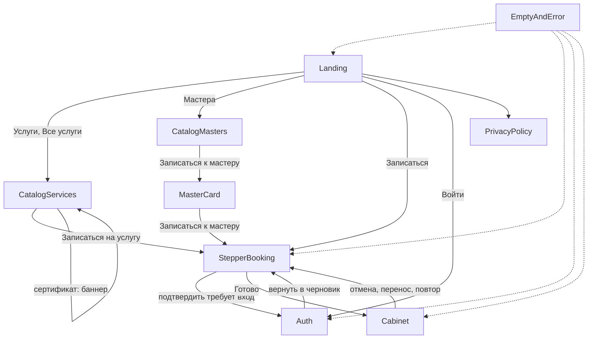

# Путь клиента «Ноготочки»

Стратегическое описание пути клиента для прототипа онлайн-записи. Это согласование логики, не промпт на отрисовку всех экранов и не задание на код.

**Готово в Figma:** только лендинг `Screens` / `Landing — Ноготочки` (`node-id=45-3`). Каталога, записи и кабинета в макете ещё нет.

**Источники:** `Паспорт сервиса «Ноготочки».md`, `figma.md`, `cloud.md`. Компоненты — из библиотеки файла `PN8kfs5KAmLwwqZIKmnAOG`. Новых продуктовых фич вне паспорта нет.

---

## 1. Инварианты

Их нельзя нарушать ни в прототипе, ни в копирайте.

- Сайт **не принимает оплату**. Нет корзины, checkout и платёжных полей. Слот резервируется на сайте, полную предоплату берёт студия вне сервиса.
- Статусы записи: **ожидает предоплату** / **подтверждена** / **отменена** / **перенесена** / **истекла**.
- Публично — только «центр города». **Точный адрес** показывается в кабинете **после статуса «подтверждена»**, строкой Meta, не картой.
- Имя мастера может быть пустым → в интерфейсе **«Мастер студии»**. ФИО и телефон не выдумывать.
- Слот держится **ограниченное время**. Минуты резерва не назначать: закладываем состояние и компонент `Timer`.
- Цены и длительности — только из паспорта, без скидок.
- **Дизайн ногтей** — добавка к сеансу (+15–30 минут), не отдельный визит без основной услуги.
- **Подарочный сертификат** есть в прайсе, но это не запись на слот: не смешивать с выбором времени мастера.
- Запись требует авторизации.
- Приём только по предварительной записи, без выезда на дом.
- В v1 нет админки, карты, чата, отзывов-карусели, выезда на дом.

---

## 2. Допущения

В паспорте не задано. Помечены, чтобы не принять за факт.

| Тема | Допущение |
|---|---|
| Горизонт календаря | **8 недель вперёд** от сегодня. Дальше дни недоступны (`Time Slot` в состоянии unavailable). |
| Когда стартует резерв | В **момент выбора времени** на шаге 3. Резерв живёт через вход, если гость логинится на шаге 4. |
| Дизайн ногтей в сумме | В итоге визита писать **«+15–30 мин»**, не выбирать одно число из диапазона. |
| Сертификат | Карточка прайса **без** запуска степпера. Пояснение `Banner / Neutral`: купить можно в студии, это не запись. |
| Когда требуется вход | Гость может выбрать услуги, мастера и слот. **Подтвердить запись** — только после входа или регистрации. Черновик и резерв сохраняются. |
| Адрес при «ожидает предоплату» | Ещё не показывать. Появляется, когда студия переводит запись в «подтверждена». |
| Повтор из истории | Подставляем те же услуги; мастера — только если он всё ещё доступен. Иначе шаг мастера открыт заново. |

---

## 3. Карта экранов

Один экран — будущий отдельный фрейм на `Screens`, десктоп 1440. Лендинг не пересоздавать и не класть на него каталог, запись и кабинет.

### 3.1. Публичные

| Экран | Назначение | Пресет / компоненты |
|---|---|---|
| Лендинг | Уже готов. Ведёт в каталоги и в запись | `Landing — Ноготочки` |
| Каталог услуг | Семь позиций прайса, вход в запись с предвыбором | Editorial + сетка `Service Card` |
| Каталог мастеров | Список мастеров студии | Сетка `Master Card` |
| Карточка мастера | Расписание и запись к этому мастеру | `Master Card` Schedule=Line или Slots |
| Политика конфиденциальности | Ссылка из футера | Текст + `Nav Header` + `Footer` |

На публичных экранах нет точного адреса, телефона и выдуманных ФИО.

### 3.2. Авторизация

Отдельные экраны, не полноэкранные empty. Пароль — `Field/Password` (глаз / глаз перечёркнутый).

1. Вход
2. Регистрация
3. Письмо восстановления отправлено
4. Новый пароль
5. Подтверждение смены пароля

Ошибки — `Alert` в форме. Связки: вход ↔ регистрация ↔ «Забыли пароль».

### 3.3. Запись (степпер)

Пресет **Booking column**: `Stepper` + колонка 720 + CTA.

1. Услуги
2. Мастер
3. Дата и время — `Calendar`, `Time Slot`, `Timer`
4. Проверка
5. Готово

### 3.4. Кабинет

Пресет **Cabinet list**: заголовок + `Tabs` / `Chip` + `Appointment Card`.

- Активные записи
- История посещений
- Детали записи
- Отмена (`Modal` + `Button/Danger`)
- Перенос (календарь и слоты, как шаг 3)
- Профиль и смена пароля
- Уведомления (`Notification Item`)
- Правила отмены и переноса

Шапка после входа: `Nav Header` Auth=Logged in. Пункт «Войти» сменяется кабинетом. Мобильное меню: Услуги / Мастера / Запись / Кабинет.

### 3.5. Служебные

Полноэкранные empty — только там, где это уже заложено в `Empty State`:

- 404 — `NotFound`
- Сбой сервера — `ServerError`
- Сессия истекла — `SessionExpired`

Ошибка входа **не** выносится на отдельный экран.

---

## 4. Связь с готовым лендингом

Лендинг остаётся витриной. Новые экраны забирают уже существующие CTA, а не добавляют корзину или оплату.

| Элемент лендинга | Куда ведёт |
|---|---|
| Логотип «Ноготочки» | Лендинг (якорь наверх) |
| Шапка «Услуги» | Каталог услуг |
| Шапка «Мастера» | Каталог мастеров |
| Шапка «Записаться» | Степпер, шаг 1, без предвыбора |
| Шапка «Войти» | Экран входа. После авторизации — кабинет |
| Hero Primary «Записаться» | Степпер, шаг 1 |
| Hero Ghost «Все услуги» | Каталог услуг |
| Карточка услуги «Записаться» | Степпер, шаг 1, услуга уже выбрана. **Кроме сертификата** — см. §7 |
| «Записаться к мастеру» | Степпер, шаг 2 уже заполнен. Услуги клиент выбирает сам (или возвращается назад и меняет мастера) |
| Финальный CTA «Записаться» | Степпер, шаг 1 |
| Футер, «центр города» | Не ссылка на карту. Текст как есть |
| Футер, политика | Страница политики конфиденциальности |
| Секция «Как записаться» | Только объяснение пяти шагов, не навигация |

На лендинге три карточки «Мастер студии» с разными специализациями. Ссылка «Все мастера» на макете скрыта: в прототипе пункт шапки «Мастера» открывает полноценный каталог.

---

## 5. Основные сценарии

### Сценарий A. Запись с лендинга (гость)

1. Клиент читает лендинг, нажимает «Записаться» (шапка, hero или финальный CTA).
2. **Шаг 1. Услуги.** Отмечает одну или несколько основных услуг. При необходимости включает дизайн ногтей как добавку. Видит сумму и суммарную длительность (дизайн — «+15–30 мин»). Нажимает «Далее».
3. **Шаг 2. Мастер.** Выбирает мастера из списка. Если имени нет — «Мастер студии» и специализация. Нажимает «Далее».
4. **Шаг 3. Дата и время.** Листает календарь в пределах 8 недель, выбирает день и свободный слот. Появляется `Timer`. Нажимает «Далее».
5. **Шаг 4. Проверка.** Видит состав, мастера, дату, время, сумму, длительность и текст: предоплату принимает студия, не сайт. `Banner / Neutral`: чтобы подтвердить, нужно войти.
6. Переходит во вход или регистрацию. После успеха возвращается **на шаг 4**, не на лендинг. Резерв и выбор сохраняются.
7. Нажимает Primary «Подтвердить запись».
8. **Шаг 5. Готово.** Статус «ожидает предоплату». Точного адреса нет. CTA «В кабинет».

### Сценарий B. Запись из каталога услуг

Как A, но шаг 1 открывается с уже отмеченной услугой. Клиент может снять её и выбрать другие, в том числе несколько.

Сертификат в этот сценарий **не входит**.

### Сценарий C. Запись с карточки мастера

1. Каталог мастеров или лендинг → «Записаться к мастеру».
2. Степпер открывается на шаге 1; выбранный мастер **запоминается** и на шаге 2 показан как текущий.
3. Дальше как A. На шаге 2 можно выбрать другого мастера через список или вернуться и сменить услуги.

### Сценарий D. Регистрация, вход, восстановление пароля (вне записи)

1. «Войти» в шапке лендинга (и любой публичной страницы с той же шапкой). Регистрация и вход **начинаются с лендинга**, не со степпера и не с отдельного домашнего экрана логина.
2. Вход по почте и паролю **или** переход к регистрации **или** «Забыли пароль».
3. Восстановление: запрос письма → экран «письмо отправлено» → новый пароль по ссылке → «Пароль изменён» → вход.
4. Успешный вход без черновика записи ведёт в **кабинет**. Если кабинет пуст — `Empty State / EmptyCabinet`.

### Сценарий E. Кабинет: просмотр, отмена, перенос

1. Клиент открывает кабинет (шапка после входа или CTA с шага «Готово»).
2. Вкладка «Активные»: карточки со статусами ожидает предоплату / подтверждена / перенесена.
3. Открывает детали. Если статус «подтверждена» — видит точный адрес строкой. Иначе адреса нет.
4. **Отмена:** «Отменить запись» → `Modal` с `Button/Danger` «Отменить запись» и Ghost «Закрыть». После успеха статус «отменена», карточка уходит в историю, `Toast` или `Banner / Success`.
5. **Перенос:** «Перенести» → календарь и слоты (как шаг 3). Подтверждение → статус «перенесена», `Banner / Success`. Старый слот освобождается.

### Сценарий F. Повторная запись из истории

1. Вкладка «История»: прошедшие, отменённые, истёкшие.
2. «Записаться снова» на карточке.
3. Степпер шаг 1 с теми же услугами (дизайн — снова как добавка, если был). Мастер подставляется, только если доступен.
4. Дальше обычная запись. Это новая запись, не воскрешение старой.

---

## 6. Степпер: действия, назад, выход

### Шаг 1. Услуги

**Показать:** список записываемых услуг из паспорта **без сертификата**. У каждой — цена и длительность. Дизайн ногтей визуально отделён как добавка (чекбокс или вторичный пункт), пока нет основной услуги — неактивен.

**Действия:** отметить/снять услуги, «Далее», «Назад» на источник (лендинг / каталог / карточка мастера).

**Правила:**

- Хотя бы одна основная услуга обязательна.
- Несколько основных можно на один визит; длительности складываются.
- Только дизайн → «Далее» неактивна, `Alert / Neutral`: дизайн добавляется к основной услуге.
- Итог: сумма по прайсу + длительность. Для дизайна не фиксировать 15 или 30 минут.

### Шаг 2. Мастер

**Показать:** карточки / список. Имя или «Мастер студии», специализация, без телефона и адреса.

**Действия:** выбрать мастера, «Назад», «Далее».

**Правила:** если ни один мастер не делает выбранный набор — `Banner / Warning` и призыв изменить услуги (вернуться на шаг 1). Не выдумывать четвёртого мастера.

### Шаг 3. Дата и время

**Показать:** `Calendar` (горизонт 8 недель — допущение), слоты `Time Slot`, после выбора — `Timer`.

**Действия:** смена месяца в пределах горизонта, выбор дня, выбор слота, «Назад», «Далее».

**Правила:**

- Слот подбирается под **суммарную** длительность визита.
- Нет окон на дату или у мастера — `Empty State / NoSlots` прямо в шаге: «Другая дата» / «Другой мастер». Это не отдельный сайт.
- Выбор нового слота снимает резерв с предыдущего.
- Минуты на таймере не подписывать в продуктовом тексте («резерв 15 минут» и т. п.).

### Шаг 4. Проверка

**Показать:** услуги, мастер, дата, время, сумма, длительность, напоминание про предоплату вне сайта. `Timer`, если резерв ещё жив.

**Действия:**

- Primary «Подтвердить запись» — только у авторизованного.
- Гость: `Banner / Neutral` + «Войти» / «Регистрация»; «Подтвердить» неактивна или ведёт на вход.
- «Назад» — на шаг 3. Состав можно менять, вернувшись на шаги 1–2 (резерв сбрасывается, если меняются услуги или мастер так, что слот больше не подходит).

**Не показывать:** платёжные поля, промокод, точный адрес, телефон студии.

### Шаг 5. Готово

**Показать:** запись создана, статус «ожидает предоплату», что делать дальше (предоплата студии вне сайта). CTA в кабинет.

**Нельзя:** вернуться «Назад» в степпер этой же записи. Новая запись — только новой сессией степпера.

### Навигация и выход из степпера

- «Назад» и клик по **пройденному** шагу `Stepper` возвращают назад. Будущие шаги недоступны.
- Логотип «Ноготочки» → лендинг. Черновик и резерв живут до истечения таймера; модалки «очистить корзину» нет — корзины нет.
- Пункты шапки «Услуги» / «Мастера» уводят в каталоги. Черновик не уничтожать сразу, пока резерв жив.
- После истечения резерва черновик слота сбрасывается; услуги можно не выкидывать, но время выбрать заново — см. `ReserveExpired`.

---

## 7. Дополнительные сценарии

Их нет отдельными продуктовыми фичами — это те же экраны в другом порядке.

### Вход в середине записи

Гость дошёл до шага 4 → вход или регистрация → возврат на шаг 4 с тем же составом и слотом. Если за время авторизации резерв истёк — не на проверку, а в `Empty State / ReserveExpired`.

### Возврат со степпера на лендинг

Логотип или осознанный уход. Если позже снова «Записаться» и резерв ещё жив — вернуть к текущему шагу. Если истёк — начать с шага 1 (услуги можно предзаполнить из черновика, слот нет).

### Сертификат в каталоге

В сетке услуг карточка остаётся: 3 000 ₽ или 5 000 ₽, 6 месяцев. CTA **не** запускает степпер. На карточке или над сеткой — `Banner / Neutral`: сертификат покупают в студии, онлайн-запись к нему не относится. В степпер сертификат не попадает.

На лендинге у этой карточки сейчас общая подпись «Записаться». В прототипе каталога и на следующих экранах поведение должно быть как выше; лендинг не пересобирать в рамках этого документа.

### Уведомление об истекающем резерве

Пока клиент на шаге 3–4: `Banner / Warning` + живой `Timer`. В кабинете (если успел войти) — `Notification Item` типа reserve_expiring. После истечения — `Empty State / ReserveExpired`, запись сначала.

### Потеря сессии во время записи

`Empty State / SessionExpired` + «Войти». Копирайт компонента: выбранные услуги сохранятся. После входа — к черновику. Слот — только если резерв ещё не истёк; иначе выбрать время заново.

### Несколько услуг, мастер «не тот»

Клиент набрал маникюр и брови, а у выбранного мастера только одна специализация. На шаге 2 — `Banner / Warning` и список только тех, кто может принять набор, либо призыв изменить услуги. Не обещать универсального мастера без данных.

---

## 8. Кабинет подробно

### Активные

Записи, которые ещё предстоят: ожидает предоплату, подтверждена, перенесена.

**Действия на карточке:** открыть детали, отменить (если ещё можно по правилам), перенести (если ещё можно).

Пустой список → `Empty State / EmptyCabinet`: «Пока нет записей» / «Выберите услуги и свободное время — запись займёт пару минут.» / CTA «Записаться».

### История

Отменённые, истёкшие, прошедшие визиты. «Записаться снова». Отмена и перенос недоступны — при попытке с прямой ссылки `Banner / Warning`.

### Детали записи

- Статус `Badge`
- Услуги, сумма, длительность
- Мастер («Мастер студии», если имени нет)
- Дата и время
- Адрес — **только** при «подтверждена»
- Ссылка на правила отмены и переноса

Нет карты, телефона, чата с мастером.

### Профиль

Имя/почта как есть у аккаунта, смена пароля теми же полями, что в авторизации. Успех — `Banner / Success` или `Toast`, не отдельный «экран победы» кроме уже существующего подтверждения смены пароля в auth-потоке.

### Уведомления

Типы из брифа, без новых каналов (SMS/push не обещать):

- confirmed — запись подтверждена (и тогда в деталях появляется адрес)
- reminder — напоминание о визите
- cancelled
- rescheduled
- reserve_expiring

Пустой список уведомлений — короткий empty в том же кабинетном лейауте, без нового Kind в библиотеке: заголовок + текст, CTA не обязателен. Не путать с `EmptyCabinet`.

### Правила отмены и переноса

Текстовая страница кабинета из базы знаний студии. Не выдумывать дедлайны в часах и штрафы. Если в базе формулировка общая — показать её.

---

## 9. Ошибки и нестандартные состояния

Как показывать — только существующими `Empty State`, `Banner`, `Alert`, плюс `Toast` / `Modal` / `Timer` там, где это уже в библиотеке. Полноэкранный empty не использовать для ошибки формы.

| Ситуация | Где | Компонент | Действие клиента |
|---|---|---|---|
| Пустой кабинет | Кабинет / активные | `Empty State / EmptyCabinet` | «Записаться» → степпер шаг 1 |
| Нет окон у мастера или на дату | Шаг 3 | `Empty State / NoSlots` | «Другая дата» / «Другой мастер» |
| Нет мастера под набор услуг | Шаг 2 | `Banner / Warning` | Изменить услуги |
| Резерв истекает | Шаги 3–4, уведомления | `Banner / Warning` + `Timer`; `Notification Item` | Завершить проверку или выбрать слот заново |
| Резерв истёк | Шаги 3–4 | `Empty State / ReserveExpired` | Начать запись сначала; слот не держать |
| Выбранный слот уже занят | Шаг 3–4 при подтверждении | `Empty State / SlotTaken` | Другое время; не подтверждать старый слот |
| Только дизайн без основной услуги | Шаг 1 | `Alert / Neutral` в форме | Добавить основную услугу; «Далее» неактивна |
| Ошибка входа или регистрации | Формы auth | `Alert / Danger` в форме | Исправить данные; не уводить на empty |
| Ошибка полей (пароль, пустое поле) | Формы | `Field` / `Field/Password` error | Исправить поле |
| Потеря сессии | Любой закрытый экран | `Empty State / SessionExpired` | «Войти»; услуги сохраняются |
| Страница не найдена | Любой неверный URL | `Empty State / NotFound` | На главную |
| Сбой сервера | Любой запрос | `Empty State / ServerError` | «Попробовать ещё раз» |
| Нельзя отменить / перенести | Детали, история | `Banner / Warning` | Остаться в деталях |
| Успех отмены, переноса, смены пароля | Кабинет | `Banner / Success` или `Toast` | Продолжить в кабинете |
| Сертификат не записывается | Каталог услуг | `Banner / Neutral` | Остаться в каталоге, не открывать степпер |
| Гость на шаге 4 | Проверка | `Banner / Neutral` + вход / регистрация | Авторизоваться и вернуться |
| Подтверждена запись | Детали | адрес строкой `Meta` | Прийти в студию; оплаты на сайте нет |

Копирайт empty уже есть в библиотеке — на экранах подставлять его, CTA с дефолтного «Сохранить» менять на действие контекста:

- EmptyCabinet → «Записаться»
- NoSlots → «Другая дата» / «Другой мастер»
- ReserveExpired → начать запись снова
- SlotTaken → другое время
- NotFound → на главную
- ServerError → попробовать ещё раз
- SessionExpired → «Войти»

---

## 10. Кнопки и действия по зонам

**Публичные:** «Записаться», «Все услуги», «Записаться к мастеру», «Войти», переход в каталоги. Ghost / Text для вторичного. Корзины нет.

**Степпер:** «Далее», «Назад», «Подтвердить запись». На шаге 5 — «В кабинет».

**Auth:** «Войти», «Зарегистрироваться», «Отправить письмо», «Сохранить пароль», ссылки между экранами.

**Кабинет:** открыть детали, «Отменить запись» только как `Button/Danger`, «Перенести», «Записаться снова», «Сменить пароль».

**Модалка отмены:** Danger подтверждает, Ghost закрывает без действия.

---

## 11. Что сознательно не входит в путь v1

- Оплата, предоплата на сайте, промокоды
- Карта и точный адрес на публичных экранах
- Телефон студии и выдуманные имена мастеров
- Выезд на дом, чат, отзывы-карусель, админка
- Выбор сертификата как услуги степпера
- Отдельный полноэкранный экран «ошибка входа»
- Фиксация минут резерва и горизонта календаря как «фактов паспорта» — горизонт 8 недель и момент старта резерва остаются допущениями

---

## 12. Что делать после согласования этого документа

1. Собирать экраны в Figma **по одному**, отдельные фреймы на `Screens`, из существующих компонентов.
2. Порядок и тексты промптов: `prompts/Промпты прототипа.md` (каталог услуг → мастера → карточка → авторизация с лендинга → степпер → кабинет → служебные → политика).
3. Облачный проект не создавать, пока не названа площадка.

Этот файл — источник правды по пути клиента. Паспорт по-прежнему источник правды по услугам, ограничениям и статусам. `figma.md` — по визуалу и компонентам.
